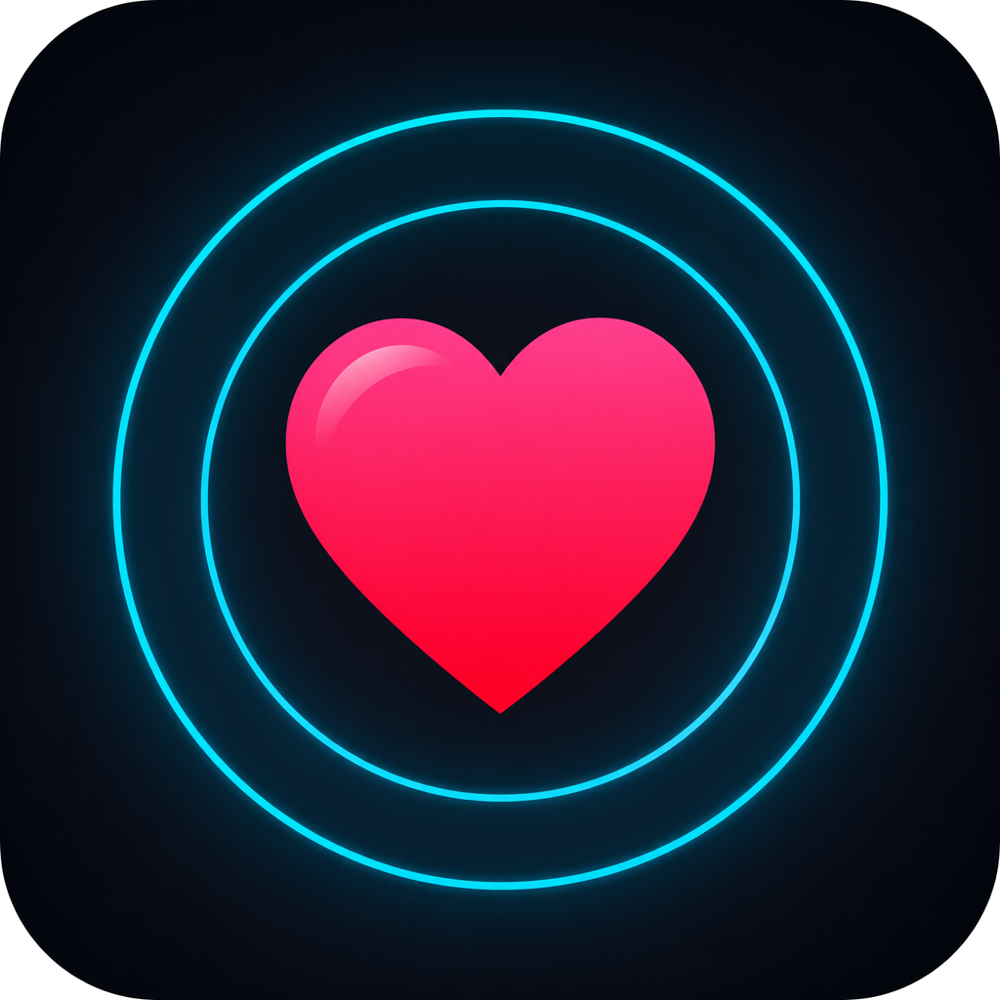
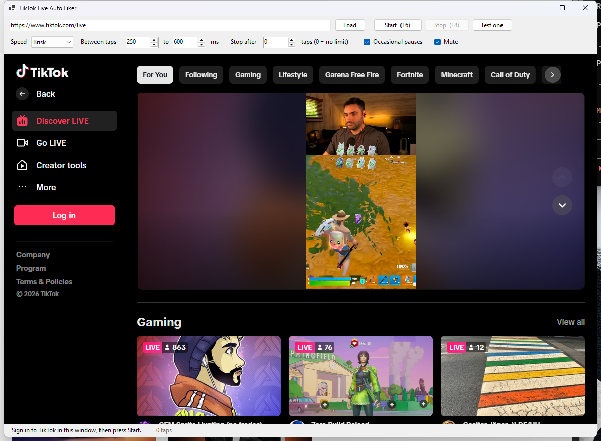

# TikTok Live Auto Liker

A small Windows app that sends double-tap likes to a TikTok LIVE stream for you.

The stream plays **inside the app** in an embedded browser, and likes are injected straight
into that browser's renderer. Nothing touches your real mouse or keyboard, so you can leave it
running in the background and keep working. No extension, no separate Chrome window, no
scripting your desktop.



## How it works

The app hosts a WebView2 browser and drives it through the DevTools Protocol
(`Input.dispatchMouseEvent`). Those arrive in the page as **trusted** input events — the same
kind a physical mouse produces — which is why they register as real likes and why the window
doesn't need focus.

Each tap is placed by locating the player element live, then picking a point inside the middle
of it. The edges are deliberately avoided: the bottom strip holds the transport controls and
the right edge holds the next/previous stream arrows.

## Humanised behaviour

Nothing about the output is on a fixed timer:

- **Scattered placement.** Every tap lands on a different pixel, drawn from a gaussian around
  the centre of the player rather than a fixed point.
- **Pointer travel.** The pointer eases from its last position to the next one across several
  intermediate move events with a slight wobble, instead of teleporting.
- **Varied press timing.** Press duration and the gap between the two presses are randomised
  per tap, always well inside the 500 ms window a double-click requires.
- **Triangular intervals.** Gaps between taps cluster mid-range like repeated human timings do,
  instead of sitting flat across the whole span.
- **Drifting cadence.** A slow random walk nudges the average pace up and down over a session,
  so an hour of taps doesn't form a suspiciously flat distribution.
- **Occasional pauses.** Now and then it stops for a few seconds, the way someone's attention
  wanders.
- **Over-tapping.** Roughly one tap in fourteen becomes a third press, the way people overshoot
  when they're mashing a like button.

## Installing

Grab **`TikTokLiveAutoLiker-win-Setup.exe`** from the
[latest release](https://github.com/hexbyt3/tiktok-live-auto-liker/releases/latest). It carries
its own runtime, so there's nothing to install first.

Installed copies **update themselves**. The app checks GitHub in the background every six hours
and downloads anything newer. It never restarts on its own — this is meant to be left running
for hours, and pulling the rug mid-session would drop an active run — so a *Restart to update*
button appears in the status bar and applying it is your call. Pressing it stops the current run
cleanly first.

There's also a `-win-Portable.zip` in the same release if you'd rather not install anything.
The portable copy doesn't self-update.

## Using it

1. Run the app.
2. Sign in to TikTok in the embedded browser. This happens once — the session is kept in
   `%APPDATA%\TikTokLiveAutoLiker\browser` and survives restarts and updates.
3. Paste the LIVE URL into the address bar and press **Load**.
4. Press **Start** (or `F6`). Press **Stop** (or `F8`) to end. Both hotkeys are global, so they
   work while another window is focused.

`Test one` sends a single double-tap so you can confirm it registers before leaving it running.

### Settings

| Control | What it does |
|---|---|
| Speed | `Relaxed`, `Brisk` or `Rapid`. Controls press and gap timing — roughly 75, 150 and 320 taps per minute at the default interval. |
| Between taps | Random rest between taps, in milliseconds. |
| Stop after | Stop automatically after N taps. `0` runs until you stop it. |
| Occasional pauses | Adds the random multi-second breaks described above. |
| Mute | Mutes the embedded stream. |

Every setting applies **live**. Change the speed or the interval while it's running and the next
tap uses the new value — no stopping and starting. If it's part-way through a long rest when you
shorten the interval, the rest is cut short so the change shows up straight away.

Settings are written to `%APPDATA%\TikTokLiveAutoLiker\settings.json` as you change them, so they
survive even if the app is killed rather than closed.

## Requirements

- Windows 10/11 x64
- Microsoft Edge WebView2 Runtime — already present on Windows 11 and current Windows 10

The released build is self-contained, so .NET does not need to be installed.

## Building

For a quick local build, a single ~2 MB framework-dependent exe (needs the
[.NET 10 Desktop Runtime](https://dotnet.microsoft.com/download/dotnet/10.0)):

```bash
dotnet publish -c Release -o dist
```

To reproduce a release build, matching what the workflow does:

```bash
dotnet tool install -g vpk --version 1.2.0
dotnet publish -c Release -r win-x64 --self-contained -p:PublishSingleFile=false -o publish/
vpk pack --packId TikTokLiveAutoLiker --packVersion 1.1.0 --packDir publish/ \
         --mainExe TikTokLiveAutoLiker.exe --icon icon.ico -o releases/
```

The `vpk` CLI version and the `Velopack` package version in the csproj must match — bump them
together.

Releases are cut by pushing a `vX.Y.Z` tag matching `<Version>` in the csproj.

## Notes

Automating engagement is against TikTok's terms of service. You're using your own account and
you're accepting that risk yourself — run it at a sane rate and don't leave it hammering a
stream for hours.

## Licence

MIT
